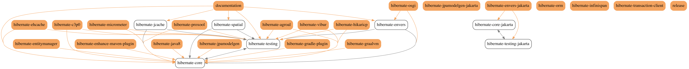

# About
This is a tool for visualizing some data as a graph. Under the hood there is GraphViz but the point is to automate data preparation.

Now, there are two types of input data: multi-module java projects (maven or gradle based) and StatefulJ controller classes (finite state machine implementation)

# Build & check
```bash
$ mvn clean package
```
## GraphViz installation
If you haven't yet installed GraphViz, it's time!  
http://www.graphviz.org/download/
## Usage information
```bash
$ java -jar gb-cli/target/graph-builder.jar -h
usage: java -jar graph-builder.jar -d <ARG> -g <ARG> -o <ARG> [-v] [-r]
       [-m] [-h]
Generate a graph from a source of data
 -d,--data-source <ARG>   data source directory
 -g,--graph-type <ARG>    data source & target graph type
 -o,--output-dir <ARG>    where results have to be created
 -v,--verbose             print additional info
 -r,--rough               make a graph with hand made style
 -m,--merge-links         try to decrease a number of links
 -h,--help                show this message
```
## Making this project modules dependencies graph (hand made style)
```bash
$ java -jar gb-cli/target/graph-builder.jar -g PROJECT_MODULE_DEPENDENCY -o ~/graphs -d . -r
```
### Output

### Annotation
As you can guess, the brown nodes are roots and the green are leaves. It is convenient to differentiate for graphs with a huge amount of nodes

# More examples
## Spring Framework (https://github.com/spring-projects/spring-framework)

## Hibernate ORM (https://github.com/hibernate/hibernate-orm)


## Java StatefulJ Framework @Transition dependencies 
For example, we can take this one https://github.com/statefulj/statefulj-framework-demo-jpa
```bash
$ java -jar gb-cli/target/graph-builder.jar -g JAVA_STATEFULJ_TRANSITION -o ~/graphs -d ../statefulj-framework-demo-jpa -m -r
```
The tool will find all java classes with @StatefulController annotation and parse @Transition annotations for states dependencies

If states have a class prefix then the tool will use cluster separation. Otherwise, you can specify a particular java class instead of the whole project. 
### Output


